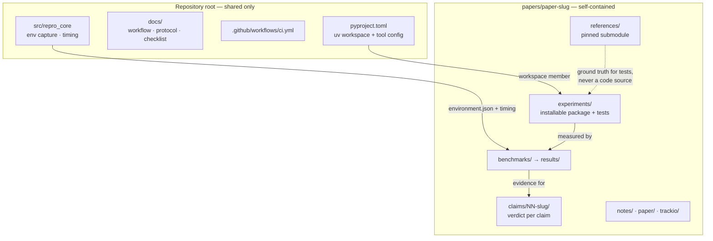

# Architecture

How this repository is organized, and why. Every structural decision here
was made against one question: **"Will this still be the right design
after reproducing 50 papers?"**

## The one-sentence design

Each reproduced paper is a **fully self-contained research project**
under `papers/<paper-slug>/`; the repository root holds only
infrastructure that is genuinely shared by *every* paper.

## Repository layout

```
icml-2026-reproductions/
├── README.md, LICENSE, CITATION.cff, CONTRIBUTING.md
├── pyproject.toml            # uv workspace root + repro-core package + tool config
├── uv.lock                   # single lockfile for the whole workspace
├── .pre-commit-config.yaml
├── .github/workflows/ci.yml  # ruff + mypy + pytest on every push/PR
├── docs/                     # project-wide standards (this file, WORKFLOW,
│                             # ROADMAP, BENCHMARK_PROTOCOL, REPRODUCIBILITY_CHECKLIST)
├── src/repro_core/           # shared infrastructure package (env capture, timing)
├── tests/                    # tests for repro_core only
└── papers/
    └── <paper-slug>/         # EVERYTHING specific to one paper:
        ├── README.md         #   paper overview + link table
        ├── PROVENANCE.md     #   per-file independence classification (integrity)
        ├── paper/            #   the paper PDF itself
        ├── supplementary/    #   supplementary material, if any
        ├── notes/            #   reading / theory / implementation notes (Phases 1–3)
        ├── claims/           #   one folder per claim (Phase 6 verdicts)
        ├── experiments/      #   reproduction code — an installable Python package
        │   ├── pyproject.toml
        │   ├── <pkg>/        #   e.g. incbpe/
        │   └── tests/
        ├── benchmarks/       #   benchmark scripts + raw run output (Phase 5)
        ├── results/          #   curated final numbers + environment.json files
        ├── figures/          #   generated plots (committed with generating code)
        ├── scripts/          #   paper-specific CLI helpers
        ├── references/       #   official implementation as a pinned submodule + notes
        └── trackio/          #   challenge/logbook publishing recipe (Phase 7)
```



## Architectural decisions

**D1 — Per-paper self-containment.** All artifacts of one paper (code,
notes, benchmarks, results, figures, reference submodule) live under one
directory. At 50 papers, the alternative — parallel top-level
`experiments/`, `benchmarks/`, `results/` trees each with 50
subdirectories — becomes 50-way index-syncing busywork and makes it
impossible to delete or archive a paper atomically. Root directories
exist only for things shared by construction (one CI config, one
protocol document, one core library).

**D2 — uv workspace, one lockfile.** The root `pyproject.toml` declares
`[tool.uv.workspace] members = ["papers/*/experiments"]`. Adding paper
51 requires zero root-config changes: give its `experiments/` a
`pyproject.toml` and it is automatically installed by
`uv sync --all-packages`, tested by the single `uv run pytest`, and
locked in the shared `uv.lock`. One lockfile means two papers can never
silently pin conflicting dependency versions without it being visible.

**D3 — Shared code is a real package (`src/repro_core`), not a scripts
folder.** Environment capture and the benchmark runner are importable,
typed, and tested like any other code, because benchmark infrastructure
bugs corrupt *evidence*. The former `framework/` placeholder directory
was retired in favor of this. Rule of thumb: code moves into
`repro_core` only when a second paper needs it — no speculative
abstraction.

**D4 — One pytest invocation, importlib import mode, fixtures live in
the package.** `testpaths = ["tests", "papers/*/experiments/tests"]`
runs everything. Test directories are not packages (no `__init__.py`);
`--import-mode=importlib` prevents module-name collisions across 50
papers' test suites. Ground-truth fixtures (e.g. `incbpe.fixtures`) live
*inside* the experiment package, not under `tests/`, because the same
data serves tests, benchmarks, and demos.

**D5 — Reference implementations are pinned submodules, never vendored
copies.** Pinned to a release tag (not a branch), placed under
`papers/<slug>/references/`, excluded from lint/type-check, and **not
checked out in CI** — tests must never silently depend on third-party
code being present. This also keeps third-party licensing cleanly
separated (see `LICENSE`).

**D6 — Strict typing and lint as a floor, not an aspiration.**
`mypy --strict` and ruff (with bugbear/pyupgrade/simplify) pass with
zero errors and are enforced by CI and pre-commit. On a repository whose
product is *trustworthy claims*, "the code type-checks strictly" is part
of the evidence chain.

**D7 — Provenance is a first-class artifact.** Every paper carries a
`PROVENANCE.md` classifying each source file as independent
implementation vs. reference-influenced, including test data derived
from reference test suites. See `docs/WORKFLOW.md` Phase 4 and
`CONTRIBUTING.md` rule 5.

**D8 — Benchmarks generate their own environment record.** Every
benchmark writes `environment.json` via `repro_core.environment` next to
its results (`docs/BENCHMARK_PROTOCOL.md`). A number without its
environment is not a result.

**D9 — Python 3.11 floor, 3.12 target.** `requires-python = ">=3.11"`;
CI tests 3.11 and 3.12. The floor matches the development sandbox so
"works locally" and "works in CI" can't diverge on syntax.

## What deliberately stays out of the root

- No root `utils/`, `common/`, or `scripts/` grab-bag directories — they
  accrete paper-specific code that then can't be moved without breaking
  imports. Paper-specific helpers belong in `papers/<slug>/scripts/`.
- No root-level results or figures — a result always belongs to a paper.
- No shared conftest magic — each paper's tests must be runnable and
  readable on their own.
