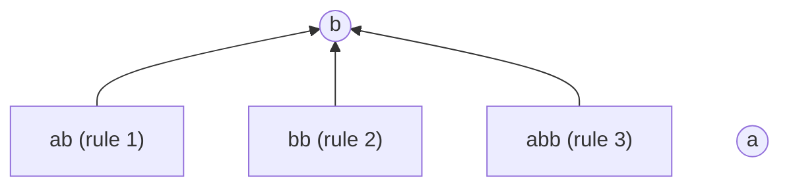

# Phase 2 — Theory Notes

Plain-language and mathematical explanation of *why* incremental BPE
works, independent of the paper's own proof structure (that's what Phase 1
already summarized faithfully). Where useful, this document builds its own
small, fully hand-verified example rather than the paper's Figure 2 —
the PDF's figure did not extract as structured, trustworthy edge data
(just a jumble of node labels and a separate rule-index table), so
reproducing it here would risk fabricating a diagram we can't actually
verify. Everything below **was mechanically checked** with a ~15-line
brute-force BPE simulator before being written down (see the shell history
of this phase for the script) — no numbers here are asserted on faith.

## 1. What BPE actually computes (baseline, for completeness)

A BPE **dictionary** is just an ordered list of merge rules
`[r1, r2, ..., rm]`, each rule `(x, y) → z` meaning "wherever tokens `x`
and `y` are adjacent, replace them with a new token `z`." Tokenizing a
string means: start from individual characters, then apply `r1`
everywhere it matches (left to right), then `r2` everywhere it matches
(against the *result* of applying `r1`), and so on through the whole list,
in that fixed order, once. That's it — no queue, no re-evaluating earlier
rules once you've moved on. This fixed, one-pass-per-rule schedule is
"standard BPE" as this paper defines it (as opposed to *SentencePiece*
semantics, which instead always finds the current single best pair
anywhere in the sequence, checked at every step — those two produce
different results on some inputs, which is what the paper's Appendix A
"properizing" section is entirely about; not needed for the core
algorithm, so parked here rather than expanded).

## 2. Why "prefix consistency" holds — boundary elimination

**Claim (Lemma 3.1):** if you tokenize a string and then cut the result at
any token boundary, the left piece is *exactly* what you'd get by
tokenizing that shorter string on its own.

**Why, intuitively:** a merge rule only ever looks at two tokens that are
*already adjacent* and glues them together. It can't reach across a token
that isn't part of the pair it's merging, and it can't un-merge anything.
So whatever happens to the *right* of a given boundary during later
merges has no way to reach back and change what already happened to the
left of it — the boundary is either consumed by a merge that spans it
(in which case it wasn't "in the token sequence" at that stage anymore)
or it survives untouched. If it survives all the way to the end, the
left piece was frozen in place since whenever it last changed, and that's
identical to just tokenizing the left piece alone.

**Worked example.** Vocabulary `{a, b}` (atomic) plus three rules, in
priority order (rule 1 highest, applied first):

1. `(a, b) → ab`
2. `(b, b) → bb`
3. `(ab, b) → abb`

Tokenizing `"abbb"` step by step:
- Rule 1 scans `[a,b,b,b]`, merges the leading `(a,b)` → `[ab, b, b]`.
- Rule 2 scans `[ab, b, b]`, finds the adjacent `(b,b)` at the end →
  `[ab, bb]`.
- Rule 3 scans `[ab, bb]` looking for an `(ab, b)` pair — there isn't
  one (the second token is `bb`, not `b`) — no match.
- Final: `T(abbb) = [ab, bb]`.

Now check prefix consistency: the token-sequence-prefix `[ab]` should be
exactly `T("ab")`. Independently: `T(ab)` — rule 1 merges `(a,b)` →
`[ab]`; rules 2–3 find nothing more to do. `T(ab) = [ab]`. ✅ Matches.
The boundary after `ab` in `T(abbb)` was never touched by later merges,
so cutting there really does hand you back the standalone tokenization of
`"ab"`.

## 3. The Last Token trick

Because of prefix consistency, you never need to store a whole
tokenization to extend it — you only need the **last token**, `θ(s)`,
because `T(s) = T(s_pre) ⊕ [θ(s)]` where `s_pre` is `s` with `θ(s)`'s
characters removed. Everything before that last token is guaranteed
frozen. So "extend the tokenization by one character" reduces to "figure
out the new last token" — a much smaller question than "re-tokenize
everything."

## 4. Successor Forest and Suffix-Successor Tree — worked example

Using the same three rules as above. Each non-atomic token `z` from rule
`(x, y) → z` gets `pre(z) = x`, `suc(z) = y`. The **Successor Forest**
draws an edge from every non-atomic token to its `suc`:

- `ab → b` (since `suc(ab) = b`)
- `bb → b` (since `suc(bb) = b`)
- `abb → b` (since `suc(abb) = b` — **not** `bb`, even though `abb` is
  built out of `ab` and `b`, not out of `bb` at all)

**The subtle, easy-to-miss point:** `ab`, `bb`, and `abb` all land as
*direct children of the same atomic node* `b`, even though as literal
strings, `"bb"` is a suffix of `"abb"`. The Successor Forest's
parent/child structure comes from **how a token was built** (its
merge-rule decomposition), not from **plain string-suffix nesting** — a
token's tree-parent can "skip" a shorter string-suffix entirely if that's
not how the merge rule actually decomposed it. This is exactly why the
paper needs a real proof (Appendix E) instead of the structure being
obviously a simple chain: naively you might expect "longer suffix →
deeper in the tree, one level per character," but the tree's actual shape
depends on the dictionary, and can legitimately be wide and shallow like
this one.

Now, the **Suffix-Successor Tree** for a token `t`, `SufSucTree(t)`, keeps
only the nodes from the forest above that are also literal string-suffixes
of `t`. For `t = "abb"`: string-suffixes of `"abb"` are `"b"`, `"bb"`,
`"abb"` — all three of our non-atomic tokens qualify (note: `"ab"` does
**not**, since it isn't a suffix of `"abb"` as a string, only a prefix —
it's excluded here even though it's in the same forest). So
`SufSucTree(abb)` is exactly the tree drawn above with `ab` removed:
`b` at the root, with `bb` and `abb` as two sibling children — genuine
branching, both candidates simultaneously "in play" as we consider longer
and longer prefixes ending near this point.

## 5. The Monotonic Path Property, made concrete

Trace `θ` (the last token) across increasing prefixes of `"abbb"`:

| Prefix | Tokenization | θ (last token) |
|---|---|---|
| `a` | `[a]` | `a` |
| `ab` | `[ab]` | `ab` |
| `abb` | `[abb]` | `abb` |
| `abbb` | `[ab, bb]` | `bb` |

Watch what happens between `"abb"` and `"abbb"`: the answer doesn't drift
gradually — it jumps from `abb` to its **sibling** `bb` in one step, and
never touches `ab` at all in this trace. Theorem 4.2 is the guarantee
that this kind of jump is always well-behaved: at any moment, the set of
tokens that could possibly be the answer forms **one single path** from
the tree's root up to the true answer — never two live candidates on
different branches at once, and never a candidate stranded outside that
path. That is precisely why an incremental search only ever needs to
track *one* moving position in the tree, not a growing set of
possibilities.

**Why does `abb` lose out to `bb` here, mechanically?** Rule 2 (`bb`)
has *higher priority* (applied earlier) than rule 3 (`abb`). When the
4th character (`b`) arrives, both `bb` and `abb` are structurally
reachable, but rule 2 fires first and consumes the trailing `(b,b)` pair
before rule 3 gets a chance to extend `ab` into `abb` again. This is
exactly the paper's **"Priority dominance"** condition (Definition 4.1,
part 2) — reachability alone isn't enough; whichever candidate's rule
has priority actually wins.

## 6. Making the check O(1): DFS linearization

Walking up/down the tree by hand to check "is this candidate still valid"
would cost O(tree height) per byte — too slow. The paper's fix: run one
pre-order DFS over the whole Successor Forest, stamping each node with an
entry time `dfs_in` and exit time `dfs_out`, **visiting children from
lowest to highest rule-priority**. Every node's subtree then corresponds
to one contiguous range of timestamps — checking "is x a descendant of u"
becomes "is `dfs_in(x)` inside `u`'s range," an O(1) check.

Numbered for our example (root `a` first, then root `b`, whose children
are visited lowest-priority-first: `abb` (rule 3), `bb` (rule 2), `ab`
(rule 1)):

| Node | dfs_in | dfs_out |
|---|---|---|
| `a` | 1 | 2 |
| `b` | 3 | 10 |
| `abb` | 4 | 5 |
| `bb` | 6 | 7 |
| `ab` | 8 | 9 |

The paper's **valid interval** for a candidate token `t` is
`[dfs_in(pre(t)), R_t)`, where `R_t` is the entry time of the first
child of `pre(t)` (scanned lowest-to-highest priority) whose priority is
`≥ t`'s own. For `t = bb` (`pre(bb) = b`): `L = dfs_in(b) = 3`. Scanning
`b`'s children lowest-to-highest priority — `abb` (priority lower than
`bb`, skip), `bb` itself (priority equal, i.e. "≥", stop here) — so
`R = dfs_in(bb) = 6`. Valid interval for `bb`: **[3, 6)**.

Check it against the trace above: right before the 4th character arrives,
the running last-token is `abb`, with `dfs_in(abb) = 4`. Is `4 ∈ [3, 6)`?
**Yes.** So the interval check correctly predicts that `bb` is a live
candidate at that moment — and since `bb`'s rule (priority 2) beats
`abb`'s own rule (priority 3), `bb` wins, exactly matching the brute-force
result (`θ(abbb) = bb`). One arithmetic comparison replaced a tree walk.

## 7. Why the search still needs Centroid Decomposition

The interval trick makes checking *one* candidate O(1). But a
`SufSucTree` can be as deep as the longest token, `t` characters — so
walking down it one node at a time to find *where the valid path ends*
is still O(t) in the worst case. **Centroid Decomposition** is the
standard trick for turning "walk a tree" into "make O(log(size))
branching decisions": repeatedly find a node whose removal splits the
tree into pieces no larger than half the current size, and recurse on
each piece. Stacking these choices into a **Centroid Search Tree** gives
a structure of height O(log t) that the search can descend instead of
the raw tree, turning "check every node until you fall off the valid
path" into "make O(log t) yes/no decisions, each backed by an O(log t)
sibling binary search (since sibling intervals are provably non-
overlapping, per the Monotonic Path Property's own uniqueness argument)."
That product, O(log t) × O(log t), is exactly the paper's **O(log²t)**
per-byte bound.

## 8. Aho–Corasick: why this specific tool

Before any of the above can run, the algorithm needs `τ(sc)` — the
*longest* vocabulary token that's a suffix of the string-so-far — in O(1)
per appended character. An Aho–Corasick automaton is built exactly for
this class of problem: it's a trie over the vocabulary with extra
"failure links" that let you fall back to the next-best partial match in
O(1) instead of restarting the search from scratch. Annotating each
automaton state with "the longest vocabulary token recognized so far"
(inherited down the failure links) turns "what's the longest matching
suffix right now" into a single annotation lookup after each character —
no separate search needed. This part of the algorithm is a well-known
technique applied correctly, not a novel contribution of the paper (the
paper itself cites Aho & Corasick, 1975, and contrasts its own O(log²t)
*search* cost against `rust-gems`' prior use of the same automaton
without the centroid-decomposition speedup, Appendix J).

## 9. Eager output — the active frontier, in plain terms

Even once you know the current `θ(s)`, you can't safely print it yet —
a future character might cause it to merge again (as `abb` merging into
something even longer could, in principle, with more rules). The paper's
fix: track how far back a new token's *parent* could possibly reach —
bounded by `d(s)`, the depth of the current Aho–Corasick automaton state
(i.e., the length of the longest vocabulary suffix currently recognized).
Any future merge's parent must be the last-token of some prefix within
the last `d(s)` characters. As more characters arrive, this window's
start can only move forward (never backward), so tokens that fall
completely out of it can be safely and permanently emitted — a two-pointer
sweep, no re-checking needed once a token is emitted. That monotonicity
(the window can only shrink from the back, never re-grow past a point
it's already passed) is what gives the amortized O(1)-per-byte cost,
the same style of argument as an amortized-analysis textbook example
(each token is inserted into the tracked window once and removed at
most once).

## 10. Revisiting the Phase 1 open questions

- **Why is Ω(n) an unavoidable floor even in the best case (Table 6)?**
  Any incremental algorithm has to at least *read* each new byte and
  perform the O(1) automaton transition on it — that's already Ω(n) of
  irreducible work no algorithm can avoid, independent of how cheap the
  rest of the per-byte logic gets. The paper's O(log²t) is the
  *additional* cost stacked on top of that unavoidable per-byte read;
  in the best case (the automaton and centroid search collapse to O(1)
  decisions, e.g. when the true answer never leaves a short path), that
  additional cost shrinks toward a constant, leaving the Ω(n) automaton-
  read cost as the dominant, irreducible term.
- **Why does Figure 3's "repeat `'a'`" pathological input differ from
  Appendix J's deliberately-constructed adversarial case?** Our worked
  example already shows why: repeating one character tends to produce
  a **wide, shallow** Successor Forest (many same-length or similarly-
  shallow siblings competing for the same short atomic root, much like
  `ab`/`bb`/`abb` all landing directly under `b`) — this stresses
  `tiktoken`'s regex/quadratic-merge handling (Claim 4's actual target),
  but doesn't necessarily stress *this paper's own* search depth much,
  since the relevant `SufSucTree` stays shallow. Appendix J's
  construction instead deliberately chains merges so that each token's
  `suc` is itself non-atomic (`suc(u)` is a longer, still-non-atomic
  token, not a one-character root) — building a genuinely **deep**
  chain (depth ~K=4096) to specifically stress the O(log²t) search
  itself, which a shallow, wide tree from simple character repetition
  would never exercise. These are testing two different failure modes,
  not the same one twice — worth reproducing both when we get to
  Claim 4, not just the simpler repeated-character case.
- **Gemma-3's non-properizable dictionary** — this is a property of
  Appendix A's properization procedure (SentencePiece vs. standard-BPE
  semantics reconciliation), which is orthogonal to Theorem 4.2 and the
  incremental search itself; deferred to whichever Phase 3/4 work
  actually needs to touch dictionary properization (likely Claim 3, when
  selecting real tokenizer vocabularies to benchmark against).

## Quick-reference glossary (paper term → plain-English one-liner)

| Paper term | One-liner |
|---|---|
| Last Token θ(s) | The final token you'd get tokenizing `s` alone. |
| Prefix Tree of Tokens | The family tree of "last tokens" across all prefixes, linked by backtracking. |
| Successor Forest | Wiring diagram connecting each token to the token that "absorbs" it into something longer, drawn from how it was actually built, not from string-suffix nesting. |
| Suffix-Successor Tree | The part of that wiring diagram relevant to one specific string's suffixes. |
| Monotonic Path Property | At any moment, the live candidates for "what's the answer" always form one connected path, never a scattered set. |
| DFS linearization / valid interval | A one-time numbering trick that turns "is this a valid candidate" into a single number-range check. |
| Centroid Search Tree | A shortcut structure that turns "walk down a possibly-long tree" into "make O(log(height)) smart branching decisions." |
| Aho–Corasick automaton | Off-the-shelf multi-pattern matcher, used here to find the longest currently-recognized vocabulary suffix in O(1) per character. |
| Eager output / active frontier | Print a token as soon as it's provably impossible for any future input to change it. |

---

> **Inference X-Ray candidate — elevated after this pass.** The
> "tree-parent ≠ string-suffix-parent" subtlety in Section 4 above (§4 of
> this document) is, on its own, a strong, self-contained teaching moment:
> most explanations of BPE stop at "merges happen in priority order" and
> never surface that the *resulting* dependency structure between tokens
> can look nothing like simple suffix nesting. Worth a short, standalone
> Inference X-Ray note built directly from the `ab`/`bb`/`abb` example
> above — it's small enough to fully hand-verify in a reader's head.
