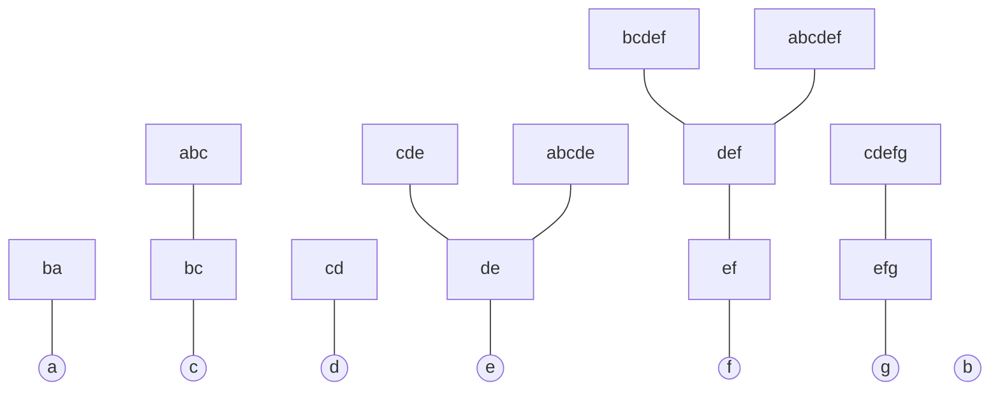

# Phase 3 — Implementation Notes

Verified mapping from the paper's theory (Phases 1–2) to the actual
source of the official reference implementation,
[`ModelTC/mtc-inc-bpe`](https://github.com/ModelTC/mtc-inc-bpe) (vendored
at [`../reference/mtc-inc-bpe`](../reference/mtc-inc-bpe), tag `v0.9.1`).
This replaces the filename-guess table in
[`../resources/official-implementation.md`](../resources/official-implementation.md)
with a table built by actually reading every non-test-utility source file.

## Major discovery: the authors preserved their own Figure 2 example in the test suite

The paper's Figure 2 (Successor Forest example, vocabulary
`{a,b,c,d,e,f,g}` plus 14 merge rules) did not extract as trustworthy
structured data from the PDF — just a jumble of node labels and a
separate rule-index table (noted in Phase 2). But while reading
`successor.rs`, `suf_suc.rs`, `centroid.rs`, `inc_bpe.rs`, and `eager.rs`,
the **same 13-rule vocabulary and rule list turns up as the test fixture
in every one of them** (`test_suc_forest`, `test_node_set`,
`test_centroid`, `test_inc_bpe_demo`, `test_eager_bpe_demo`) — missing
only rule 13 (`"cef"`, per the paper's own numbered list in Figure 2) out
of the paper's 14. This is, almost certainly, the authors' own worked
example, preserved as a regression test. That means we can get
**authoritative, tool-verified ground truth** for Figure 2 (minus one
token) by literally running their test suite — which is exactly what the
rest of this document does, rather than reconstructing the figure by hand
or by further guessing.

Rule list used below (in priority order, rule 0 highest, applied first —
identical across `successor.rs`, `suf_suc.rs`, `centroid.rs`,
`inc_bpe.rs::test_inc_bpe_demo`, `eager.rs::test_eager_bpe_demo`):

```
0: (b,c)->bc      1: (e,f)->ef      2: (d,e)->de      3: (c,d)->cd
4: (d,ef)->def    5: (b,a)->ba      6: (a,bc)->abc    7: (abc,de)->abcde
8: (abc,def)->abcdef   9: (bc,def)->bcdef   10: (c,de)->cde
11: (ef,g)->efg   12: (cd,efg)->cdefg
```

Reproduced with (from the vendored submodule):

```bash
cargo test --lib successor::tests::test_suc_forest -- --nocapture
cargo test --lib suf_suc::tests::test_node_set -- --nocapture
cargo test --lib inc_bpe::tests::test_inc_bpe_demo -- --nocapture
cargo test --lib eager::tests::test_eager_bpe_demo -- --nocapture
```

## The real Successor Forest (verified, not guessed)

Decoded directly from `test_suc_forest`'s printed `SucNode` structs
(`parent` field = `suc(token)`, i.e. the forest edge target):



Two things confirmed exactly as predicted in the Phase 2 theory notes,
now with the paper's own numbers instead of our invented example:

1. **`b` is a root with no children at all** in this vocabulary — nothing
   in the dictionary has `suc(·) = b`. Not every atomic token needs
   descendants.
2. **Genuine sibling branching, twice** — `de` has two children, `cde`
   and `abcde` (from rules 10 and 7 respectively); `def` has two
   children, `bcdef` and `abcdef` (rules 9 and 8). Both are exactly the
   "tree-parent skips a shorter string-suffix" phenomenon from Phase 2
   §4: e.g. `abcde`'s forest-parent is `de` (length 2), not `cde`
   (length 3) even though `"cde"` is also a string-suffix of `"abcde"` —
   the *merge-rule decomposition* (`abc` + `de` → `abcde`) is what
   determines the edge, not string-suffix nesting. `suf_suc.rs`'s test
   output makes this split explicit: it tracks a **separate**
   `suffix_parent` pointer (the actual string-suffix chain) alongside the
   forest `parent` — e.g. node `abcde`'s forest-parent is `de`, but its
   `suffix_parent` is `cde` — precisely the two different relations
   Phase 2 predicted, now confirmed as two distinct fields in real code
   (`suf_suc.rs:41`, populated by the BFS in `SufSucNodeSet::new`,
   `suf_suc.rs:56-70`).

## Real θ-traces, straight from the reference implementation

Running `test_inc_bpe_demo` on this vocabulary/rule set gives the actual
incremental-tokenization trace for three strings (`token_id` in
parentheses; this is the non-eager `IncBpeTokenizer::tokenize`, i.e. the
sequence of `θ` values as each character is fed in):

| String | θ trace (one entry per character fed) |
|---|---|
| `abcdefg` | `a(1) → b(5) → abc(2) → d(13) → abcde(3) → abcdef(4) → g(20)` |
| `babcdefg` | `b(5) → ba(6) → b(5) → bc(7) → d(13) → de(14) → bcdef(8) → g(20)` |
| `cdefg` | `c(9) → cd(10) → cde(11) → ef(17) → cdefg(12)` |

Two of these traces are more dramatic than our small Phase 2 example and
worth walking through explicitly, because they show the search doing more
than a one-step sibling jump:

- **`babcdefg`, 7th character (`f`)**: before this character, the
  tokenization stood at `[ba, bc, de]` (three tokens covering `babcde`).
  Feeding `f` collapses the **last two** tokens (`bc` and `de`) together
  with the new character into a single token `bcdef` — θ jumps from `de`
  to `bcdef`, skipping past the intermediate `def` node in the forest
  (θ never visits `def` itself, since `bcdef` — a *child* of `def` — is
  reached directly by the search). Only the leading `ba` stays frozen,
  exactly matching `T(s) = T(s_pre) ⊕ [θ(s)]` with a `s_pre` shorter than
  one might naively expect from a "grow-by-one" mental model.
- **`cdefg`, 4th character (`f`)**: before this, θ was `cde` (tokens
  `[cde]` covering `cde`). Feeding `f` throws `cde` away entirely and
  replaces it with `ef` — the *predecessor* component `c`+`d` implicitly
  re-splits back into separate characters as far as the live search is
  concerned, and the last token becomes just `ef` (covering only the
  last two characters `e,f`). Then the 5th character (`g`) merges `ef`
  and the (re-surfaced) `cd` all the way up into `cdefg` in one step.
  This is the clearest evidence in the whole example that the
  incremental search is doing genuine re-derivation of which suffix
  tokens are valid — not simply "extend or reset by one" — while still
  producing the exact same answer standard BPE would (confirmed by the
  test's own `validate()` helper, which cross-checks every prefix against
  `bpe_with_heap` — the from-scratch reference oracle in `sp_impl/`).

`test_eager_bpe_demo` on the same input additionally confirms the eager
emission cadence — e.g. for `abcdefg`, nothing is emitted until the
*second-to-last* character is known to be safe (`[abcdef(4)], [g(20)]`
come out together, right at the end), while for `cdefg` nothing is
emitted until the whole string resolves to the single token `cdefg` —
consistent with §6's claim that eager output only emits once every live
candidate converges to the same path, which for these short strings
often means "at the very end."

## Verified module map

| Module | Paper correspondence | How verified |
|---|---|---|
| `vocab.rs` | §3.1 vocabulary `V` — token↔id mapping, byte/char fast paths for atomic tokens | Read in full |
| `dict.rs` | §3.1 dictionary `D` — ordered `Rule` list, `(pre,suc)→rule` lookup | Read in full |
| `normalize.rs` | §3.3 Normalization (canonical tokens/rules, the `pre`/`suc` bijection) **and** Appendix A (properizing) — `NormalizedDictBuildError::ImproperDict` is literally the Appendix A.6 non-properizable-dictionary detector | Read in full |
| `successor.rs` | §3.4 Successor Forest — `SucForest`/`SucNode`; `skip_len` field = token length, used later to jump back in a flat array instead of storing/copying strings | Read in full + ran `test_suc_forest`, reconstructed the real Figure-2-variant forest above |
| `suf_suc.rs` | §3.5 Suffix-Successor Tree infrastructure **and** §4.3 DFS linearization / valid-interval computation (`calc_valid_pre_node_id_range`, `suf_suc.rs:72-115`) **and** §5.2's automaton-state → longest-recognized-token annotation (`longest_token_node`) | Read in full + ran `test_node_set`, confirmed real `suffix_parent` vs. forest-`parent` divergence |
| `aho_corasick/trie.rs` | Plain trie storage underlying the automaton (§5.2) | Read in full |
| `aho_corasick/automaton.rs` | Classic Aho–Corasick construction: BFS + failure-function loop for suffix links (§5.2, standard technique, not this paper's contribution) | Read in full |
| `aho_corasick/heavy_light.rs` | **Not explicitly named in the paper text.** Heavy-light decomposition of the trie, used only to *relabel* trie/automaton node ids for cache locality before building the transition table | Read in full — flagged as an implementation detail beyond the paper's own description |
| `aho_corasick/trans.rs` | Appendix F, Square-Root Tiled Transition Table — byte split into two 4-bit "tiles" (`TRANS_TILE=16`, `16×16=256=ALPHABET_SIZE`), with copy-on-write tile sharing tracked via an `owner` array | Read in full — matches Appendix F almost exactly, including the "differs from suffix link only at trie-edge entries" sharing property (`duplicate()` + `update_trans()`) |
| `aho_corasick/relabeling.rs` | Generic node-relabeling (order/rank permutation) utility used by both the heavy-light pass and the transition-table dedup pass | Read in full |
| `aho_corasick/suf_link_tree.rs` | Wraps the raw suffix-link array into a navigable parent→children tree, used by `suf_suc.rs`'s BFS | Read in full |
| `aho_corasick/index.rs` | `ACNodeId` newtype + root constant | Read in full |
| `centroid.rs` | §5.3 Centroid Decomposition / Centroid Search Tree — `SufSucCentroidTree::new` is a textbook recursive centroid-finding routine (`next_large_subtree`); `SufSucCentroidTreeView::search` is a direct implementation of §5.3's Case 1 ("go to parent")/Case 2 ("binary search over sibling intervals") logic | Read in full + ran `test_centroid` |
| `inc_bpe.rs` | §5.1 top-level algorithm — `IncBpeTokenizer` (construction ties automaton+forest+centroid trees together) and `IncBpeTokenization::feed` (the actual per-byte update loop); the paper's abstract "history interface `H(ℓ)`" is the `skip_to` closure indexing back by `skip_len` | Read in full + ran `test_inc_bpe_demo`, `test_inc_bpe_non_longest`, `test_inc_bpe_repeated` |
| `eager.rs` | §6 Eager Output — `EagerBpeTokenization`; `frontier`/`num_frontier_bytes` = the Active Frontier window (§6.1); `move_forward_frontier`/`maintain_frontier` = the two-pointer algorithm (§6.2); `num_alive_children`/`num_roots` = the "all live paths converge to one child of the virtual root" emission check | Read in full + ran `test_eager_bpe_demo` |
| `sp_impl/bpe.rs`, `sp_impl/heap.rs` | **Not part of the incremental contribution.** A from-scratch heap-based reference BPE (`bpe_with_heap`) used internally as the ground-truth oracle every other test cross-checks against, and (`bpe_with_heap_last_merge::<true/false>`) to detect SentencePiece-vs-standard-BPE divergence for Appendix A | Skimmed via call sites and `lib.rs` exports, not read function-by-function — sufficient, since this is a testing oracle, not the paper's contribution |
| `typed_vec.rs`, `test_utils/*` | Generic infrastructure (newtype-indexed vectors, test helpers) | Not read in detail — no paper correspondence needed |

## What this means for Phase 4

The correctness oracle we should use for our own Python reproduction is
exactly the same one the reference implementation uses internally:
`bpe_with_heap` (a plain heap-based from-scratch BPE), cross-checked
against every prefix of every test string. We should build the same kind
of oracle in Python first (this is nearly free — it's the "naive"
algorithm, not the incremental one), then implement the incremental
algorithm and differential-test against it, exactly mirroring the
reference implementation's own test structure (`validate()` helpers in
`inc_bpe.rs` and `eager.rs`). The `test_inc_bpe_demo` /
`test_eager_bpe_demo` fixture above (13 rules, 3 test strings) is a ready-
made first regression test for our own implementation, with known-correct
expected output already captured in this document.
